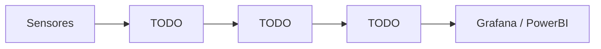

# Proyecto 03 · Smart City con FIWARE

## Descripción y objetivo

Simular una ciudad inteligente (Smart City) con la plataforma FIWARE, integrando sensores virtuales para la captura, almacenamiento y visualización de datos en tiempo real, replicando un entorno urbano digitalizado analizable con herramientas de inteligencia de negocio.

## Arquitectura

*Diagrama del pipeline completo.*

